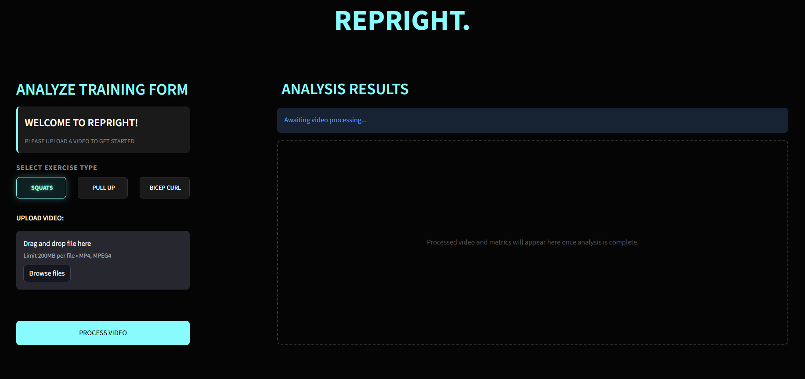

<h1 align="center">DataQuest'26 Hackathon | RepRight's AI Squat Form Analyser</h1>

<p align="center">
  
</p>

# Preview

<table>
  <tr>
    <th width="70%">🖥️ App Interface & Dashboard</th>
    <th width="30%">🦴 AI Analysis</th>
  </tr>
  <tr>
    <td valign="top">
      
      <br>
      <h3>RepRight's main page dashboard. Includes selecting an exercise (works only for squats, others coming soon...) and uploading a video.</sub>
    </td>
    <td valign="top" align="center">
      
      <br><br>
      <a href="https://www.youtube.com/watch?v=1A_R7b95vpU">
        
      </a>
      <br>
    </td>
  </tr>
</table>


---

## Problem Statement

Improper squat form causes injury — but most gym-goers have no access to real-time expert coaching. RepRight uses a custom-trained machine learning model to analyse squat form from a video upload and provide instant, actionable feedback.

---

## Solution

Upload an `.mp4` of your squat set. RepRight processes the video frame-by-frame, overlays a live skeleton with colour-coded form scoring, and returns a full analysis report including rep count, depth rating, detected faults, and an overall verdict.

---

## Demo

> Upload a side-profile squat video → Get a scored, annotated video back with feedback in seconds.

---

## Technical Stack

| Layer | Technology |
|-------|-----------|
| Frontend / UI | Streamlit |
| Video Processing | OpenCV |
| Pose Estimation | MediaPipe BlazePose |
| ML Model | Scikit-learn RandomForestClassifier |
| Data Processing | Pandas, NumPy |
| Model Serialisation | Joblib |

---

## ML Model

### Why Random Forest?

A Random Forest builds 200 decision trees, each trained on a random subset of the data. Every tree votes on the classification and the majority wins. This ensemble approach is robust to overfitting and handles small datasets well — critical given our 266-sample training set.

### Dataset

**Physical Exercise Recognition Dataset** (Kaggle) — pre-extracted MediaPipe joint angles for 10 exercise classes. We filtered to `squats_down` (good form / full depth) and `squats_up` (bad form / shallow) for a binary classification task.

- 266 samples after filtering
- 127 good form / 139 bad form (near-perfect balance)
- 5 features: left/right knee angles, left/right hip angles, back angle

### Feature Engineering

Raw landmark coordinates are position-dependent (affected by where the person stands in the frame). We convert them to **joint angles** using the dot product formula, which are position-invariant. A good squat always has a knee angle near 90° regardless of camera position.

```
cos θ = (BA · BC) / (|BA| × |BC|)
θ = arccos(cos θ)
```

### Model Performance

| Metric | Score |
|--------|-------|
| Accuracy | 90.74% |
| Test set size | 54 frames (20% split) |
| F1 Score | 0.907 |

Confusion matrix and feature importance charts are in `machine_learning/evaluation_results/`.

### Why MediaPipe is NOT our model

MediaPipe is a coordinate extractor — it gives us x, y positions of 33 body joints. It has no knowledge of squat form quality. Our RandomForestClassifier, trained from scratch during the event on labelled squat data, makes all form quality decisions. MediaPipe is equivalent to using OpenCV to read a video frame — it is infrastructure, not intelligence.

---

## Biomechanical Rules (Safety Overrides)

On top of the ML model, we apply hard biomechanical rules that can penalise the score even when the model predicts good form:

| Fault | Penalty | Detection Method |
|-------|---------|-----------------|
| Heels lifted | -30 pts | Ankle vs toe y-coordinate comparison |
| Knees caving | -25 pts | Knee width vs ankle width ratio |
| Back rounded | -20 pts | Shoulder midpoint vs hip midpoint x-offset |
| Low depth | -15 pts | Knee angle > 105° |

---

## Project Structure

```
RepRight/
├── app.py                        # Streamlit UI
├── utils.py                      # Shared angle math + feedback logic
├── requirements.txt
├── core/
│   ├── video_processor.py        # OpenCV frame loop + skeleton overlay
│   └── model_inference.py        # Loads model, runs prediction
└── machine_learning/
    ├── prepare_dataset.py        # Kaggle CSV → cleaned training data
    ├── train_model.py            # Trains RandomForest, saves .pkl
    ├── squats_dataset.csv        # Cleaned training data
    ├── squat_model.pkl           # Trained model
    ├── label_encoder.pkl         # Label mapping
    └── evaluation_results/
        ├── confusion_matrix.png
        └── classification_report.txt
```

---

## Setup & Run

**Requirements:** Python 3.12, pip

```bash
# Create virtual environment with Python 3.12
py -3.12 -m venv venv312
.\venv312\Scripts\Activate.ps1   # Windows
source venv312/bin/activate       # Mac/Linux

# Install dependencies
pip install -r requirements.txt

# Run the app
streamlit run app.py
```

---

## How to Film for Best Results

- Film from the **side at 90°** to your body
- Ensure **shoulders, hips, knees, ankles, and heels** are all visible
- Stand **6–8 feet** from the camera at hip height
- Use **good lighting** — avoid bright windows behind you
- Film **3–10 reps**, keep video under **60 seconds**
- Wear **form-fitting clothing** for better landmark detection

---

## Judging Deliverables

- GitHub Repository: this repo
- Model accuracy: **90.74%** (RandomForestClassifier, 266 samples)
- Confusion matrix: `machine_learning/evaluation_results/confusion_matrix.png`
- Presentation slides: linked in submission

---

## Requirements

```
mediapipe==0.10.14
opencv-python==4.10.0.84
scikit-learn==1.5.2
pandas==2.2.3
numpy==1.26.4
joblib==1.4.2
streamlit==1.40.0
plotly==5.24.1
```
